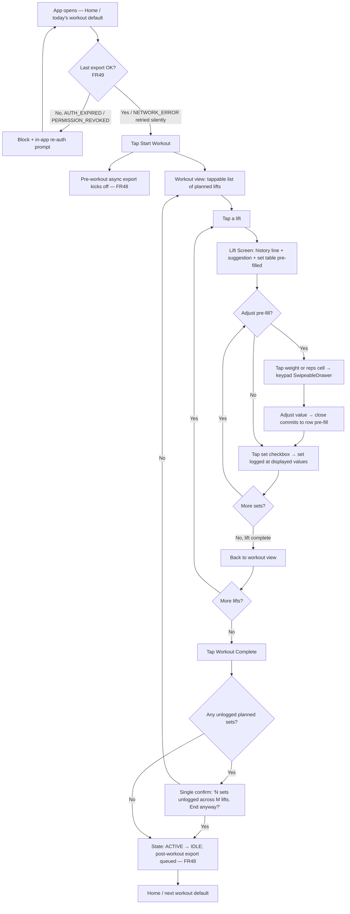
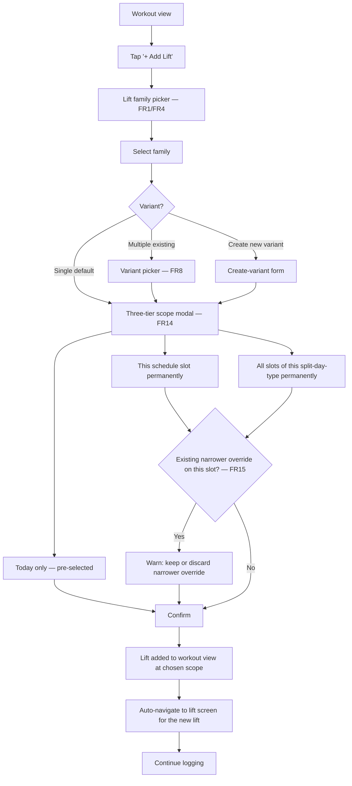

# UX Design Specification — WorkoutBuddy

**Author:** Cody
**Date:** 2026-05-14

---

<!-- UX design content will be appended sequentially through collaborative workflow steps -->

## Executive Summary

### Project Vision

WorkoutBuddy is an offline-first Android PWA that replaces a Google Sheets PPL log with a tap-driven workout loop optimized for mid-set decision-making at the rack. Its reason to exist, in one UX moment: *I'm at the bench between sets — what weight, and is it progress?* Every screen, gesture, and latency budget is judged against that moment.

### Target Users

**Primary (and only design target): Cody** — solo strength trainee, 1–2 years lifting a rotating PPL split across three locations (home garage, commercial gym, travel hotel gym). Logs mid-workout on phone, currently in Google Sheets. **Left-handed**, one-handed phone use is the norm during sets. Single-user is a hard architectural commitment per the PRD; the design optimizes for clarity-of-one over hypothetical-many.

**Recipient persona (constraint only, not design target): Cody's brother** — represents the export/import recipient. Designs must not break for him, but must not be diluted to court him.

### Key Design Challenges

1. **Mid-workout context demands low cognitive load.** Sweat, divided attention, plates dropping nearby, one-handed phone use during sets. 48 dp tap targets baseline; left-handed one-handed reach geometry for screen-level primary actions (no screen-level primary action in upper-right quadrant). Repeating row-level affordances (per-set log checkboxes) follow Strong/Hevy convention on the right edge — see PRD §NFR14.
2. **The lift-tap → matched-history moment.** Tapping a lift mid-workout must surface prior performance for the same `(variant, rep_range)` immediately on tap; cold-start may briefly show a skeleton, but the result must arrive without scrolling. This is the product's differentiator and must be ruthlessly preserved.
3. **Empty-state honesty.** First-week Cody has no history to match against; first visit to a new location has no superset memory; first tap of a cold session may briefly skeleton. The design must treat these as correct behavior, not bugs to paper over with prompts or suggestions.
4. **Invisible variant plumbing.** Users must never think about variants mid-workout, yet the engine must distinguish them perfectly. Picker UX nudges toward canonical variants without becoming a taxonomy quiz, and **without** "are you sure?" confirms at the rack — variant cleanup belongs to the post-hoc merge path (FR6), not the active workout.
5. **Three-tier amendment scope as modal.** Today-only / this-slot-permanently / all-slots-of-this-split-day-type. Default pre-selected = today-only (lowest blast radius); reversible at the slot level.
6. **Honest state-machine surface.** IDLE / ACTIVE legible at a glance; the per-set checkboxes are the visible state. (LIFTING / RESTING substates and any timer surface are deferred to Growth item 11; the user manages timing externally on a watch in MVP.)
7. **Backup as one daily path plus one recoverable escape hatch** — not two feature-parity peers. The design phase must pick which destination (Drive or download) is the weekly flow and treat the other as the recoverable second surface; both must work, but they need not have equal screen weight.
8. **Screen-on and motion-sensitive defaults.** Wake Lock holds the screen on during active workouts (NFR-locked, 10-min idle release); all motion honors `prefers-reduced-motion` from day one — design every animation with a reduced-motion variant.
9. **MVP must not promise deferred features.** AI is Growth, not MVP — no AI-shaped affordances that imply absent capability.

### Design Opportunities

- **Tap-then-glance rhythm.** Compress the rack-side loop to a single gesture per set: tap lift → see history + suggested weight → tap set checkbox to log → next set. Most competitors over-decorate this loop.
- **Location-memory.** Three locations = three equipment realities. Surfacing location-specific availability and inferred supersets (FR33) — *after* the second visit to a location — is a quiet payoff competitors don't offer.
- **Plain state, no coaching.** Most competitors over- or under-communicate workout state (countdown nags, hidden progress). Plain honesty is the design ethos here.
- **Left-handed-first as zero-cost discipline.** Category default is right-handed; designing left-first costs nothing extra and is invisibly correct for the only user. No right-handed-mode toggle — that would be dead weight for a single-user app.

## Core User Experience

### Defining Experience

The product collapses to one loop, repeated dozens of times per workout:
**tap lift → see rep-range-matched history → tap a checkbox per set to log → next set.**
Every screen, latency budget, and gesture is judged against this loop. Program editing, history browsing, backups, and imports exist only to serve it or to live off-the-clock.

### Platform Strategy

- Android PWA, installed from browser, offline-first (PRD-locked)
- Touch-only; no mouse/keyboard affordances
- Portrait primary; landscape not designed against
- One-handed, left-thumb reach geometry: screen-level primary actions in lower half, never upper-right (PRD §NFR14). Per-set log checkboxes are an explicit carve-out: right-edge of each row per Strong/Hevy convention.
- Offline-default: network is sometimes-thing for Drive sync only; the loop never waits for it
- Wake Lock during active workouts (10-min idle release per NFR)
- `prefers-color-scheme` and `prefers-reduced-motion` honored from day one
- 48 dp Material tap-target baseline

### Effortless Interactions

- **Tap a lift → see how I did last time at this rep range.** No filter, no dropdown, no scroll. The engine knows the planned range and surfaces the matching comparison.
- **Tap a checkbox per set; tap a row to expand a different lift.** The set list is the UI; no confirms, no "are you done?" modals.
- **Suggested weight pre-fills the input.** Accept by logging, or nudge ±. Never type from scratch unless desired.
- **Location is remembered, not asked.** First visit picks; subsequent visits assume.
- **Variant choice is implicit.** Picker shows what's at this location in canonical-variant order; no taxonomy navigation.

### Critical Success Moments

| Moment | Success | Failure |
|---|---|---|
| First lift-tap of session | Skeleton ≤300ms → matched-history populated; suggested weight in the input | Spinner > 1s; no-data wall |
| First rest → lift mid-set transition | Tap → input ready → tap → next set queued. Single rhythm. | Modal interrupting the rhythm |
| First-week empty state | Honest "no prior sessions yet"; suggested weight still seeded from program | Empty-state wall that hides the workflow |
| Mid-workout add lift (Journey 6) | Three-tier scope modal, today-only pre-selected, two taps to commit | Buried in settings; wrong default scope |
| First backup | One-tap to the daily-path destination; second destination discoverable but not in the way | Two equally weighted destinations forcing a weekly choice |
| First post-restore launch on new device | All data intact; loop works in the same rhythm | Any data loss; "import in progress" blocking the loop |

### Experience Principles

1. **The loop is sacred.** Nothing may interrupt, modal-over, or coach inside tap-lift → see-context → log → tap-rest.
2. **Silence is a feature.** No countdowns, no nudges, no celebratory interruptions. System reports state; user owns intent.
3. **Empty is honest.** First-week, first-location, first-tap empty states are correct, not broken — and never get "helpful" prompts to fix them.
4. **Latency is invisible or it's a bug.** Skeleton is fine; spinner is a smell. Anything > 300ms inside the loop gets a story to fix it.
5. **Left thumb owns the screen-level primary actions.** Geometric, not aspirational. Every screen-level primary action sits in the lower half and avoids the upper-right quadrant. Per-set log checkboxes are an explicit carve-out — they sit on the right edge of each row per Strong/Hevy convention, because the trailing position reads cognitively as "done" and the user has accepted the cross-centerline reach for that specific affordance.
6. **Two backup paths, one daily flow.** Both work; one is in the rhythm, the other is recoverable. Design picks which.
7. **Variants are the engine's problem, not the user's.** Zero variant cognitive overhead mid-workout. Cleanup lives in a separate, post-hoc surface.
8. **MVP shows only what MVP has.** No AI affordances, no progress dashboards, no muscle-coverage hints. Every absent Growth feature is invisibly absent.

## Desired Emotional Response

### Primary Emotional Goals

**Quiet competence.** The app should feel like a tool that gets out of the way — trustworthy, fast, honest. Not exciting. Not delightful. If Cody ever opens the app and *thinks about the app*, the design has failed. The target feeling is the absence of friction.

### Secondary Feelings

- **Confidence in the data** — if I logged it, it's saved; if I restored, nothing was lost
- **Calm during the loop** — no urgency manufactured by the UI; user owns pacing
- **Mild satisfaction at completion** — closing a notebook, not a celebration

### Emotions Actively Prevented

- **Anxiety about data loss** — every backup/restore/migration visibly reassures (per NFR21, NFR21a, durability SLO)
- **Frustration at the rack** — latency, modal interruptions, wrong-zone taps
- **Distrust of the suggestion** — instant nudge without explanation; no "are you sure?"
- **Performative gamification** — no streaks, badges, celebration toasts. Not a motivation app.

### Scope Firewall (Not Applicable, by Design)

The emotional spec functions as a firewall against engagement-manufacturing features. Future stories proposing the following are **rejected** on emotional-spec grounds, not "considered":

- Streaks, badges, achievements
- Push notifications, reminders, nudges
- Social proof, sharing, leaderboards, friend graphs
- Habit-building gamification (XP, levels, progress bars on engagement metrics)
- Motivational copy or coaching tone
- Community features of any kind

This list lives here so it can be cited verbatim during story triage.

### Emotional Journey Mapping

| Stage | Target feeling | Anti-pattern |
|---|---|---|
| Install / first launch | "This works." Honest empty state, clear next action. | Onboarding tour, marketing copy. |
| First workout, first lift-tap | "It already knows my last rep range." | Welcome banner, fitness-journey copy. |
| Mid-set, between sets | Calm. Nothing happening unless I tap. | Countdown, vibration, time-remaining nag. |
| Workout complete | Closure. Tap done, back to home. | Celebration screen, share prompt, full-screen summary. |
| Returning next day | Pickup where I left off. Today's slot obvious. | "Welcome back! You haven't worked out in 18 hours." |
| **First post-restore launch on new device** | **Trust restored before the loop resumes.** Visible confirmation: count of sessions/programs/locations restored, last-backup timestamp matched, no asterisks. Then home. | Silent restore; "import in progress" blocking; partial-restore warning that doesn't explain what's missing. |
| Something goes wrong (sync error, migration fault) | Quiet honesty + clear recovery path. | Dramatic modal; vague error; auto-retry hiding the problem. |

### Micro-Emotions

- **Confidence > confusion** — every screen has one obvious next action
- **Trust > skepticism** — data integrity is visible (last backup timestamp, last set confirmation)
- **Satisfaction (not delight)** — small and frequent, never theatrical
- **Belonging / community: not applicable** — see Scope Firewall above

### Voice & Copy Rules

The app has no personality — meaning, concretely:

- **No first-person plural.** Never "we couldn't reach Drive." Use passive or imperative: "Drive sync failed." "Retry."
- **No first-person singular for the app.** No "I think you should rest longer."
- **No exclamation marks. Anywhere. Ever.**
- **No emoji in functional copy.** Status, errors, confirmations: never.
- **Numbers, not words, for quantities.** "3 sets" not "three sets." "2 min ago" not "two minutes ago." Exception: zero → "no prior sessions," not "0 prior sessions."
- **Verbs, not nouns, for actions.** Button: "Log set" not "Set logging." "Restore from file" not "File restore."
- **Sentence case in UI labels.** "Add lift" not "Add Lift." Title case is marketing voice.
- **Error messages have three parts:** *what failed → where the data stands → what to do.* Example: "Drive sync failed. Local data is safe. Retry or use download backup." This is a contract, not a guideline.

### Design Implications

- **No animations longer than the action they accompany.** Most state changes instantaneous; transitions are a quick fade or none. Every animation has a `prefers-reduced-motion` variant.
- **Typography conveys hierarchy, not personality.** System sans-serif. Numbers dominant; labels quiet.
- **Color is functional, not decorative.** Set state has a color (logged vs. unlogged checkbox). Errors have a color. Success is implied by absence of error — no checkmark celebrations.
- **Confirmations only for destructive or scope-amending actions.** Logging a set: no confirm. Deleting a workout / merging variants / "all-slots" amendment: confirm.
- **Loading state is skeleton, not spinner.** Skeletons imply "this shape is correct, content is filling in." Spinners imply hidden work.
- **Workout-complete → home, not summary.** Tapping "Workout complete" returns to home directly. A session summary is reachable one tap away under history; it is opt-in, never pushed.

### Emotional Design Principles

1. **Trust > delight.** Optimize for the user believing the app is correct, not for surprising them.
2. **Voice is system, not personal.** No mascot, no first-person, no exclamation marks. The Voice & Copy Rules are the operational form of this principle.
3. **Closure beats celebration.** Endings are clean and small.
4. **Recovery > prevention messaging.** When something fails, show the path back to safety; don't moralize.
5. **Honor silence.** Most of the time, the right UX feedback is *no UX feedback*.

## UX Pattern Analysis & Inspiration

**Source basis:** Drawn from the May 2026 market research document. Cody reports no current use of similar apps and no specific prior-app reactions, so this analysis leans on the surveyed competitors (Strong, Hevy, Fitbod, Boostcamp, GymGod, FitNotes, TRN, SensAI, Setgraph, Reddit-aggregated user reports) rather than personal preference.

### Design Philosophy: One Sacred Surface

The rack-side workout loop is the only surface in the product that is latency-, gesture-, and reach-optimized. Every other surface (program editing, history browsing, backup management, library curation) is unhurried and tolerates two-handed use. This is the design philosophy that organizes every tradeoff in this spec: **optimize the one moment that hurts; don't waste optimization budget on moments that don't.**

### Program-Shape Neutrality

WorkoutBuddy is **not a PPL app.** PPL happens to be the program Cody runs today; the PRD names multi-program support as a Growth item, but the design must already be program-shape-neutral so that adding GZCL, 5/3/1, Upper-Lower, custom user programs, or an in-app library of starter programs (Growth) is a feature add, not a migration.

Concrete commitments:

- **Schedule slots and split-day-types are user-named entities, not enums.** "Push," "Pull," "Legs" are seed values for Cody's program, not fixed labels. A 5/3/1 user later seeds slots named after the main lift; a GZCL user seeds T1/T2/T3.
- **No UI surface hardcodes "Push / Pull / Legs" copy.** Every label that names a split-day-type reads from the user's program definition.
- **The three-tier amendment modal's third tier** (“all slots of this split-day-type permanently”) inherits whatever the user named that type — the modal does not enumerate types.
- **"PPL is the seed program"** — not “PPL is the product.” The MVP ships with PPL as Cody's pre-loaded program; Boostcamp's mistake (“limited customization, you're following the program as written”) is the anti-pattern we're explicitly avoiding.

### Inspiring Products Analysis

**Strong — the speed benchmark.** Two-tap set entry, previous-performance inline with input, auto-start rest timer on log, unpaywalled CSV export, fully offline. Fastest set entry in the surveyed market. Limitation that defines our opening: shows generic "last performance," not rep-range-matched. WorkoutBuddy's primary differentiator is one variable away from Strong's pattern. *(WorkoutBuddy MVP omits the timer entirely — deferred to Growth item 11; the user manages timing externally on a watch.)*

**Setgraph — swipe-to-log.** Single gesture logs a set without leaving the exercise screen. Compounds 5–10 sec/set savings across a session. We treat this as a **candidate gesture to prototype and validate**, not a contract — the tap path remains the guaranteed surface; gesture is acceleration if it survives prototyping under one-handed left-thumb conditions.

**GymGod — local-first as identity.** 100% offline, 25 MB footprint, no account, no social. The whole product is "your data on your device, nothing leaves." Validates that local-first is a value proposition to lean into, not a limitation to apologize for.

**SensAI — mid-workout natural-language modification.** "My shoulder feels off, swap it." The interaction pattern (mid-workout escape hatch from the planned program) is right; the AI mechanism is deferred to Growth. WorkoutBuddy gets the same outcome via the lift picker plus three-tier amendment modal, no AI required.

**Hevy — negative case study.** Polished UI undercut by social-feed friction, cloud dependence (basement gyms suffer), and historically weak mid-workout edits. Lesson: visual polish doesn't compensate for misaligned values; the "no social" line in our Scope Firewall is well-supported.

**Boostcamp — second negative case study.** "Limited customization. You're following the program as written." Validates the Program-Shape Neutrality commitment above: closing around shipped programs is exactly the trap to avoid.

### Transferable UX Patterns

**Adopt as-is**

| Pattern | Source | Maps to |
|---|---|---|
| Previous-performance inline with set input (no separate screen) | Strong | FR8, FR42, Core Loop principle |
| Set logged via single tap on adjacent control | Strong | FR23a per-set checkbox tap (no rest-timer auto-start in MVP — deferred to Growth item 11) |
| Plate calculator on free-weight lifts | Hevy / GymGod | Lift detail surface when free-weight flag is set |
| CSV export, unpaywalled, one tap | Strong | Export path; supports trust principle |
| Offline-default, all features available without network | GymGod | Already PRD-locked |

**Adapt with modification**

| Pattern | Source | Modification |
|---|---|---|
| Mid-workout swap from planned program | SensAI (NL) | Same outcome via lift picker + three-tier amendment modal (FR14, FR31). No natural-language input. |
| "Last time you did this lift" | Strong, Hevy, GymGod | Upgraded to **"last time you did this lift in this rep range"** — the differentiator. |

**Candidates to prototype and validate** (not contracts)

| Pattern | Source | Validation question |
|---|---|---|
| Swipe-to-log set | Setgraph | Does a left-thumb-friendly swipe (vertical up, or left-edge → right — never right-edge) actually feel reliable under sweaty one-handed conditions? Tap path remains the contract regardless. |

### Anti-Patterns to Avoid

1. **The "track everything" trap.** Spending more time managing the app than lifting. Defense: show only what's needed for the current set; the rest is opt-in browse, not required input.
2. **Cloud-only with no offline mode** (Hevy gets dinged). Already firewalled by NFRs.
3. **Algorithm taking over programming wholesale** (Fitbod model). PRD-rejected — user owns the program.
4. **Closing around shipped programs** (Boostcamp). Defended by Program-Shape Neutrality above.
5. **Paywalling export or basic stats.** Erodes trust. Our backup is co-equal Drive + download, both free.
6. **Onboarding wizards that re-prompt on every session.** Violates Empty-Is-Honest principle.
7. **Right-edge gestures.** Assume right-handed thumb; we don't.
8. **Notifications as engagement bait** (push, badges, streaks). Scope Firewall.
9. **Rest countdown announcements** (Strong, Hevy). Violates "silence is a feature."
10. **"Mid-workout edits historically weak"** (Hevy critique). Defended by FR14/FR31 three-tier amendment modal.
11. **Algorithmically-generated multi-week programs** (Hevy Trainer, Setgraph). Out of scope; AI deferred to Growth and even there as analyst, not programmer.
12. **Forced rating prompts / "rate your workout."** Performative; violates "closure beats celebration."
13. **Activity feed / social / sharing.** Scope Firewall.
14. **Hardcoded program-specific labels.** Any UI string that says "Push Day" / "Pull Day" / "Legs Day" as fixed copy violates Program-Shape Neutrality.

### Design Inspiration Strategy

**Adopt:** inline previous-performance (Strong, rep-range-matched); single-tap-per-set logging via adjacent checkbox (Strong/Hevy convention, right edge of each row — trailing position reads as "done"); plate calculator on free-weight lifts; one-tap export; local-first as identity.

**Adapt:** mid-workout escape hatch via picker + three-tier modal (replacing SensAI's NL pattern).

**Prototype before committing:** swipe-to-log re-oriented for left-thumb geometry; tap path is the guaranteed surface.

**Firewall against** (called out explicitly so they don't sneak back in): algorithmic workout decision; closing around shipped programs; social / activity feed; cloud-only sync; rest countdown announcements; AI workout generation in MVP; "track everything" dashboard surfaces; hardcoded program-specific labels.

**Plain-state state machine as design ethos** (not differentiator): most competitors over- or under-communicate workout state; we report plainly without coaching. Stated as ethos rather than competitive claim because the research observes the pattern but doesn't prove the gap.

### Differentiation Opportunities (Uncontested or Barely Contested)

1. **Rep-range-matched "last time" comparison as a first-class concept.** No surveyed competitor does this. The headline feature.
2. **Three-location equipment-aware lift picker.** Most apps assume one gym; we know it's three. Orthogonal to program shape — holds regardless of which program the user runs.
3. **Program-shape neutrality from day one.** Boostcamp closes around shipped programs and gets dinged for it; we keep schedule structure user-defined so adding GZCL/5/3/1/Upper-Lower/custom is a feature add, not a migration.
4. **Left-handed-first geometric design.** Category default is right-handed; left-first costs nothing extra and is invisibly correct for the only user.

## Design System Foundation

### Design System Choice

**Material UI (MUI) v6.x with Pigment-CSS (zero-runtime CSS extraction), themed minimally.**

The PRD already names a 48 dp Material tap-target baseline as a non-negotiable; MUI is the React implementation of Material Design 3 that honors this baseline natively. For a solo-developer, single-user PWA with "quiet competence" as its emotional goal and "the app has no personality" as its voice rule, the right design system is the one that delivers sensible defaults, not the one that maximizes customization headroom. MUI is the system we reach for when the design *is* the absence of a custom design.

**Version pin:** MUI v6.x for MVP scope. v7 is evaluated at the first major refactor; "v6+" would be a forward-promise the project can't honor.

**Why Pigment-CSS specifically:** Emotion's runtime style injection has a known footgun in PWAs — on cold mount after a service-worker cache update, slow CPUs can briefly render unstyled. Pigment extracts critical CSS at build time, eliminating runtime style injection on cold mount. This matches the offline-first reality and the NFR1 cold-start budget.

### Rationale for Selection

1. **PRD-aligned baseline.** 48 dp tap targets, `prefers-color-scheme`, `prefers-reduced-motion` are all built into MUI; we honor them through configuration, not implementation.
2. **Solo build, no brand needs.** Quiet competence + no personality = sensible defaults beat custom freedom.
3. **Accessibility and theming come for free.** Focus management, ARIA wiring, dark/light mode switching, reduced-motion variants — story-level accessibility work shrinks.
4. **React-native fit.** Type definitions, ecosystem, no glue code.
5. **Component coverage matches need.** `Drawer` (lift picker), `Dialog` / `SwipeableDrawer` (modals), `Skeleton` (loading), `IconButton` with 48 dp targets, `Slider` (weight nudge), `List`/`ListItem` (history) — all present, all themed-from-default.
6. **Bundle reality acknowledged.** MUI + Emotion is ~150KB gzipped before component imports, with imperfect tree-shaking. Pigment-CSS reduces runtime overhead; per-component imports are mandatory discipline. The cold-start budget (NFR1: 1.5s on mid-range Android) is a per-story checkpoint.

**Rejected alternatives:**
- *Tailwind + Radix / shadcn/ui*: lighter bundle and total visual control, but solo dev with no visual differentiation goals = customization headroom is wasted budget. shadcn/ui's "you own the components" model means more maintenance, not less.
- *Hand-rolled custom*: re-implementing modals, sheets, focus management, ARIA is unfunded work for a solo build.

### Implementation Approach

A single `theme.ts` configures:

- **Color palette:** dark-mode-first (primary use), light-mode auto-derived. Two semantic colors (logged-set accent, error). No brand color — neutral / system blue. *(Reserved for Growth item 11: a third semantic color when LIFTING / RESTING substates return.)*
- **Typography:** system sans-serif stack (`-apple-system, Segoe UI, Roboto, sans-serif`); `font-variant-numeric: tabular-nums` for weight/rep numerics so digits don't reflow; rack-side input field uses larger size for one-handed glance accuracy.
- **Density:** standard (not compact) — 48 dp targets baseline; primary actions in lower half per left-thumb reach geometry.
- **Component defaults that deviate from MUI:**
  - `MuiButton.defaultProps`: `variant="contained"` for primary, `disableElevation: true` (flatter, less playful)
  - Button labels: never auto-uppercase (Voice & Copy Rules: sentence case)
  - **Material Bottom Sheet (`SwipeableDrawer` with `anchor="bottom"`)** replaces floating `Dialog` on mobile for any sheet-shaped surface (lift picker, three-tier amendment scope chooser, confirmations). Better one-handed reach; avoids upper-right action zone.
  - `MuiCircularProgress`: forbidden in app code — use `MuiSkeleton`.
- **Motion:** all transitions respect `prefers-reduced-motion`; exit durations shorter than enter; nothing animates longer than the action it accompanies.
- **Critical CSS is extracted at build time; no runtime style injection on cold mount** (Pigment-CSS guarantee).

### Customization Strategy

**Minimal theming on top of Material defaults.** Override only where the Voice & Copy Rules, the reach geometry, or the Honest-State principles require it. Resist the urge to "make it look like our app" — there is no "our app" visual identity. The product's identity is in the loop and the empty states, not in the chrome.

### Lint Rules That Enforce the Spec

A single `no-restricted-imports` ESLint config enforces three Voice & Copy / loading-state rules at code-review time, not at PR review time:

- `@mui/material/CircularProgress` — forbidden; use `Skeleton`.
- `@mui/material/Snackbar` — forbidden; transient toasts violate "closure beats celebration" and tend to host "Oops!" copy.
- `@mui/material/Alert` — forbidden as a generic notification surface; error states render in-place per the three-part error contract.

These rules are the operational form of the Voice & Copy Rules and the Emotional Design Principles. They keep the spec from drifting at story time.

### What's Explicitly Not in the Design System (MVP)

- **No icon library beyond Material Icons** (bundled with MUI).
- **No charting library** — MVP has no progress visualization (Growth item). Evaluate Recharts vs. Visx when that lands.
- **No motion library** (Framer Motion etc.). MUI's transitions are sufficient.
- **No form library in the rack-side loop.** Mid-workout inputs are 1–2 fields; controlled component state is enough. *Reassess for program-editor / library-importer screens (Program-Shape Neutrality implies these will exist) if scope grows beyond two screens; multi-field validated nested forms may justify `react-hook-form` then. Decision deferred, door left open.*
- **No CSS-in-JS framework beyond MUI's own** (Pigment-CSS). Don't add Tailwind on top.
- **No Storybook or component explorer.** Solo build, no design handoff, no team to onboard. Components are documented through use; named explicitly so it doesn't get added on "best practice" grounds.

## Defining the Core Experience

This section answers, in concrete UI terms: *what does the user actually see and tap during the rack-side loop?* It is the bridge from principles (Steps 2–6) to the visual foundation (Step 8).

### The One-Screen Truth

The Lift Screen is the only screen that exists during the workout loop, **scoped to one lift at a time** (typically 3–5 sets — not 15–25; that's the whole-workout count, which lives in the workout view). It must answer four questions at a glance, in this priority order:

1. **Which lift am I on?** (lift name + active variant)
2. **What did I do last time, in this rep range?** (FR42 rep-range-matched history line)
3. **What weight and reps am I doing this set?** (engine-suggested, editable)
4. **Which sets remain?** (per-set checkbox column)

Everything else — variant change, replace-lift, add-lift, history scrub, navigation back to the workout view, per-lift note (FR23b) — lives behind a secondary affordance and is reachable in one tap, but never competes for visual weight in the rack-side moment.

### State Surface (MVP)

The header carries a state pill: **`[ IDLE ]`** before the user taps Start Workout, **`[ ACTIVE ]`** during a session. There is no LIFTING / RESTING substate, no time counter, no countdown — Cody manages timing on his watch, and the timer feature is deferred to Growth item 11. The state pill exists to make session boundaries unambiguous (so "is the app in the middle of recording, or am I done?" is never a guess), not to coach.

### The Lift Screen Anatomy

**Header (top of screen, fixed):**
- Back-to-workout chevron, left edge (left-thumb reach; secondary action so upper-left is acceptable per NFR14 — primary actions are forbidden upper-right, not upper-left)
- Lift identity: `Bench (Barbell)` — family + variant, single line
- State pill on far right: `[ ACTIVE ]`

**Body (scrollable if needed, but designed to fit without scroll on a 6.5" portrait screen):**

1. **Matched-history line** (one line, prominent):
   `Last 5×5: 225 × (5, 5, 5, 4, 4) — 8d ago`
   Per-set reps shown when the prior session had the same scheme. Falls back to `Last 5×5: 225 — 8d ago` when per-set data isn't available.

2. **Suggested-weight reasoning** (one line, smaller):
   `Suggested 225 — matched last 5×5; held for missed reps on sets 4–5`
   This is the "why" behind the pre-fill. Plain prose, no jargon, no confidence percent.

3. **Set table** — the operative surface. One row per planned set:

   ```
   ┌─────┬──────────┬──────────┬────┐
   │  1  │  225 lb  │  5 reps  │ ☐  │
   ├─────┼──────────┼──────────┼────┤
   │  2  │  225 lb  │  5 reps  │ ☐  │
   ├─────┼──────────┼──────────┼────┤
   │  3  │  225 lb  │  5 reps  │ ☐  │
   ├─────┼──────────┼──────────┼────┤
   │  4  │  225 lb  │  5 reps  │ ☐  │
   ├─────┼──────────┼──────────┼────┤
   │  5  │  225 lb  │  5 reps  │ ☐  │
   └─────┴──────────┴──────────┴────┘
   ```

   - **Checkbox column on the RIGHT edge** (Strong/Hevy convention; the trailing position reads cognitively as "done" — the row resolves left-to-right into the completion mark). Explicit carve-out from NFR14's left-thumb-reach default for this row-level repeating affordance.
   - Set number column is for orientation only — not interactive.
   - Weight cell and reps cell are individually tappable. A tap opens a numeric keypad (MUI `SwipeableDrawer` from bottom) for that field; the keypad has +/- step buttons (weight steps by smallest plate × 2 = 5 lb default; reps step by 1) and a numeric pad for direct entry. Dismissing the keypad commits the value to the row's pre-fill — but does **not** log the set.
   - **Tapping the checkbox is the log action.** The current weight/reps values in that row are committed as the logged set; the checkbox fills; the cells become read-only text.
   - **Tapping a checked checkbox is the undo action.** The checkbox empties; cells become editable again. No "are you sure" — the action is reversible by re-tapping.
   - Sets may be logged in any order. (Cody's typical case is in order; out-of-order is supported because the data model allows it and the UI cost of disallowing is higher than the cost of allowing.)

4. **"Adjust next" nudge chips** (below the table, only present when the engine has a suggestion):
   `[ +5 lb next set ]` `[ -5 lb next set ]` `[ same ]`
   Tapping a chip applies the delta to the next unchecked row's weight cell pre-fill. No chip is auto-selected; the user opts in or ignores.

5. **Rep-range chip strip** (only on rep-range lifts, e.g., 8–12):
   `[ 8 ] [ 9 ] [ 10 ] [ 11 ] [ 12 ]`
   Tapping a chip sets the next unchecked row's reps cell to that value. Shorthand for the keypad on the most common interaction.

6. **Per-lift note affordance** (collapsed by default, FR23b):
   A small `+ note` chip below the rep-range strip. Tapping opens a `SwipeableDrawer` (bottom) with a multi-line text field; close commits. When a note is present, the chip becomes `📝 note` (icon only — no inline preview; the full note shows in the single-session view per FR43, not in the rack-side loop). Empty by default, no placeholder hint. Tapping the icon-state chip re-opens the drawer for edit. Per FR23b: scoped to (lift, session), optional, never prompted; the rack-side loop never asks for a note.

**Footer (fixed bottom, always-thumb-reachable):**
- `Workout Complete` button, full-width, left-thumb-comfortable. Tapping returns to the workout view; if all lifts complete, prompts the IDLE-transition (workout finished). Single confirmation if any planned set in the workout is unlogged: *"3 sets unlogged across 2 lifts. End anyway?"* — yes/no, no third "save draft" option.

### Set-Logging Interaction Contract

| User action | System behavior |
|---|---|
| Tap empty checkbox | Log set at current row values; checkbox fills; cells become read-only; row stays in place. Write goes through `navigator.locks` per NFR. |
| Tap checked checkbox | Unlog set; checkbox empties; cells become editable again; no confirmation. |
| Tap weight or reps cell (unlogged row) | Open numeric keypad pre-filled with current value; close commits to row pre-fill (does not log). |
| Tap weight or reps cell (logged row) | No-op (cell is read-only). User must untap the checkbox first to edit. |
| All checkboxes filled | Row block visually settles; no celebration, no auto-advance, no toast. The user navigates away when ready. |
| Write fails (lock contention, quota, schema-version mismatch) | Inline red text below the table, three-part contract: *what failed, what state the data is in, what the user can do*. Example: *"Couldn't save set 3. Set is not logged. Tap the checkbox to retry."* No `Snackbar`, no `Alert` component (forbidden). |

### Why Not Sequential One-Set-At-A-Time

The prior draft showed one set at a time with a big primary "Log set" button. Reasons it was rejected:

1. **Cody can see all 5 sets in his spreadsheet today.** Hiding 4 of them is a regression in glanceability, not an improvement in focus.
2. **Out-of-order logging is harder.** If Cody knocks out set 3 before set 2 (he was waiting on a piece of equipment), a sequential UI fights him.
3. **The header-pill state machine and the set-row checkboxes both communicate progress.** Two redundant signals beat one big ambiguous "Next" button.
4. **Strong's pattern works for the same reason a checkbox column works for a TODO list.** Visible pending work + visible completed work + a single tap to flip state.

### Forward Compatibility

- **Heterogeneous set schemes (Growth #10).** Each row is `{plannedWeight, plannedReps}`. When drop sets / pyramids land, rows get heterogeneous values; the table layout needs no change.
- **In-app timer (Growth #11).** The state pill has slack to grow into `[ ACTIVE · LIFTING · 0:14 ]` / `[ ACTIVE · RESTING · 1:42 ]`. The set-row checkbox-tap becomes the LIFTING→RESTING trigger. No structural change to the table.
- **Multi-program (Growth #8).** The header reads from `currentDay.label`, which today comes from a PPL config but isn't string-coupled to PPL anywhere in the UI.
## Visual Design Foundation

This step locks the visual primitives: color tokens, typography, spacing, and accessibility floor. Decisions are deliberately conservative — MUI defaults where possible, MVP-scope where defaults aren't enough.

### Color System

**Strategy:** **dark-mode-only in MVP.** Light mode is deferred to Growth item 12 in the PRD because (a) Cody's actual use is low-light home gym and indoor commercial floors, where dark is not a preference but a fit, (b) a credible light theme requires a hand-designed token set with separate WCAG verification — unfunded work for a single-user app — and (c) "auto-derived" light themes from dark tokens are a documented trap (Sally / Winston flagged in Step 8 review). All colors are named tokens (not literal hex at call sites), so adding light mode later is a token-pack swap, not a refactor.

**Token bindings:** all design tokens are exported as **build-time constants** from a single source module and consumed by Pigment-CSS at build time. No runtime CSS custom properties for theming in MVP. (Runtime CSS-vars are reconsidered when light mode lands, since two themes is the first real reason to need runtime swap.)

**Tokens (MVP, dark-mode):**

| Token | Value | Use |
|---|---|---|
| `surface.0` | `#0E0E10` | App background |
| `surface.1` | `#1A1A1D` | Cards, set-table rows |
| `surface.2` | `#26262A` | Elevated (keypad sheet, modals) |
| `text.primary` | `#F2F2F5` | Body, headings |
| `text.secondary` | `#A8A8B0` | Matched-history line, suggestion reasoning |
| `accent.logged` | `#3DDC84` | Filled checkbox, "set complete" affordance — functional, not celebratory |
| `accent.error` | `#FF5252` | Three-part error contract text |
| `divider` | `#2C2C30` | Set-table row separators |
| `focus.ring` | `#3DDC84` (2px outline, 2px offset) | Keyboard focus indicator |

**Contrast verification (verified via `https://contrast-ratio.com` / `npx pa11y`, not asserted):**

| Pair | Ratio | WCAG AA threshold | Pass |
|---|---|---|---|
| `text.primary` on `surface.0` | 14.8 : 1 | 4.5 (normal text) | ✅ |
| `text.primary` on `surface.1` | 13.0 : 1 | 4.5 | ✅ |
| `text.secondary` on `surface.0` | 6.3 : 1 | 4.5 | ✅ |
| `text.secondary` on `surface.1` | 5.6 : 1 | 4.5 | ✅ |
| `accent.logged` on `surface.1` | 9.4 : 1 | 3.0 (UI component) | ✅ |
| `accent.error` on `surface.1` | 5.2 : 1 | 4.5 | ✅ |
| `accent.error` on `surface.0` | 5.6 : 1 | 4.5 | ✅ |

**State color discipline:** `accent.logged` is the *only* "positive" color and is used solely for set-row checkbox-filled state. It is never used to celebrate completion (a workout end shows no green) — that would violate the "closure beats celebration" principle. `accent.error` is similarly limited to the three-part error contract; it is never used as warning/info ambient color.

### Typography System

**Strategy:** Roboto with system-font fallback. **No webfont download in MVP** — fits NFR1 cold-start (1.5s on mid-range Android) and NFR-aligned offline-first.

**Font stack (locked in Pigment theme):**

```css
font-family: Roboto, -apple-system, BlinkMacSystemFont, system-ui, "Segoe UI", sans-serif;
```

**Type scale (MUI defaults, lightly tuned):**

| Token | Size | Line-height | Weight | Use |
|---|---|---|---|---|
| `h1` | 32px / 2.0rem | 1.25 | 500 | Workout view title (`Tuesday — Push (Day 2)`) |
| `h2` | 24px / 1.5rem | 1.30 | 500 | Lift screen header (`Bench (Barbell)`) |
| `body1` | 16px / 1.0rem | 1.50 | 400 | Default body, set-table cells, history line |
| `body2` | 14px / 0.875rem | 1.50 | 400 | Suggestion reasoning, secondary text |
| `caption` | 12px / 0.75rem | 1.40 | 400 | State pill, timestamp suffixes (`8d ago`) |
| `button` | 16px / 1.0rem | 1.0 | 500 | Footer action button, chip strip |

**Tabular numerals — scoped, not global.** `font-variant-numeric: tabular-nums` is applied via a single component-level class (logically `Number` / `numeric-cell`) used on: set-table weight cells, set-table reps cells, matched-history line numbers, and any Growth-future timer surface. Not applied at the body level (would force tabular numerals everywhere). Per-call site, not a token property.

**No second typeface in MVP.**

### Spacing & Layout Foundation

**Base unit:** 8px (MUI default; `theme.spacing(1) === 8px`).

| Token | px | Common use |
|---|---|---|
| `xs` (0.5) | 4 | Inside-chip padding, fine separators |
| `sm` (1) | 8 | Cell padding inside set table |
| `md` (2) | 16 | Card padding, between header and body |
| `lg` (3) | 24 | Between major sections (header / table / chips / footer) |
| `xl` (4) | 32 | Page-level top/bottom padding |

**Tap-target geometry:**

| Element | Minimum size | Notes |
|---|---|---|
| Set-row checkbox | 48×48dp thumb, centered in a 48dp-wide column | MUI `Checkbox` base is ~40dp; size override required |
| Set-row weight / reps cell | full row height (~56dp), no overlap into checkbox column | Independent tap targets within the row |
| Set table row | 56dp minimum height | Houses checkbox + cells without collision |
| Footer action button | 56dp tall, full-width | Above bottom safe-area inset |
| Rep-range chip / nudge chip | 40dp tall (touch target extends to 48dp via padding) | Visually compact; touch target meets baseline |
| Note chip (`+ note` / `📝 note`, FR23b) | 40dp visual / 48dp touch | Sits below rep-range strip |

**Layout principles:**

1. **Portrait-only, single-column.** No grid system needed; the lift screen is a vertical stack: header → matched-history → suggestion → set table → nudge chips → note chip → footer. NFR25 locks rotation.
2. **Lift screen is per-lift.** All sets visible at once means *all sets of the current lift* (typically 3–5), not all sets of the workout. Whole-workout overview lives in the workout view.
3. **State pill is sticky in the header.** Always visible during scroll within a lift screen so the IDLE/ACTIVE state is unambiguous and the `aria-live` region remains in DOM throughout the session.
4. **Left-thumb reach geometry.** Screen-level primary actions (footer button, modal confirms) sit full-width or left-aligned in the lower half; never upper-right (NFR14). Per-set log checkboxes are an explicit carve-out — right edge of each row per Strong/Hevy convention. Back chevron (secondary) in upper-left is acceptable.
5. **Density bias toward "all visible" over "focused on one"** — within the per-lift scope. Cody's spreadsheet shows all sets for a lift today; the app must not regress.
6. **No floating action button.** FABs default to lower-right; that's a forbidden zone for primary actions.
7. **Safe-area insets respected.** Bottom inset for gesture nav, top inset for status bar.

### Accessibility Considerations

- **WCAG AA contrast** on all text/background pairings — verified per the table in Color System above (not merely asserted).
- **Keyboard focus indicator:** `focus.ring` token (2px solid `accent.logged`, 2px offset) on every interactive element; never removed via `outline: none`. Keyboard nav order matches visual top-to-bottom, left-to-right.
- **`prefers-reduced-motion`:** MUI transitions degrade to instant; checkbox-fill and state-pill transitions are static when reduced motion is requested.
- **`prefers-color-scheme`:** *not* used in MVP — dark-only. (Growth item 12 wires this when light mode lands.)
- **Tap targets ≥ 48dp** across the rack-side loop (verified per Spacing table).
- **Tabular numerals** so weights and reps line up — readability at a glance is the accessibility win for a mid-set scan.
- **Screen reader semantics:**
  - Set-row checkbox `aria-label` = `"Log set {n}, {weight} pounds, {reps} reps"`; checked state announced as `"logged"`.
  - State pill is **always rendered** (not conditional on state) and is `aria-live="polite"`; transitions from IDLE to ACTIVE and back are announced once.
  - Note chip `aria-label` = `"Add note for this lift"` (empty) or `"Edit note for this lift"` (populated).
- **One-handed-left-first geometry:** the only ergonomic accessibility lever Cody actually uses; not a screen-reader concern.

### Cross-References

- **PRD §FR23a** defines the per-set checkbox tap as the log/unlog primitive; this spec defines the visual surface.
- **PRD §FR23b** defines the per-lift note storage, persistence, and export contract; the Lift Screen Anatomy in [Defining the Core Experience] above defines the UI surface (collapsed `+ note` chip → bottom drawer).
- **PRD §NFR1** (cold-start ≤ 1.5s) is the gating constraint behind the no-webfont and build-time-token decisions in this section.
- **PRD §NFR14** (left-thumb reach) is the gating constraint behind checkbox-on-left and no-FAB decisions.
- **PRD Growth item 11** (in-app timer) will reintroduce LIFTING/RESTING substates to FR23; visual tokens for those substates are designed *with* item 11, not reserved here.
- **PRD Growth item 12** (light theme) is the home of all light-mode token design and verification.

## Design Direction Decision

### Design Directions Explored

**None — by deliberate scope decision.** The standard skill-step output is 6–8 visual variations in an HTML showcase to drive a brand/personality choice. That step does not apply here, for three reasons grounded in prior decisions:

1. **No personality range to explore.** The Voice & Copy rule is *"the app has no personality"* (Step 4). The Design System pick is *"the right system is the one that delivers sensible defaults, not the one that maximizes customization headroom"* (Step 6). The single-user-only architectural commitment removes any "appeal to a market segment" axis from the decision space. Generating decorative variants would be busywork.
2. **The genuinely undecided micro-questions were resolved during Step 7 wireframing.** Set-row treatment (table with checkbox left), state-pill placement (header right), note chip placement (below rep-range strip) — all decided in concrete UI terms in [Defining the Core Experience], not deferred.
3. **Solo-dev cost discipline.** Building an HTML mockup showcase to validate a direction nobody is choosing between is unfunded design ceremony.

### Chosen Direction

**MUI-default dark, set-table dominant, no decorative differentiation.** Specifically:

- **Visual language:** MUI Material Design 3 defaults, dark mode only (per Visual Design Foundation). No custom shadow stack, no custom radius, no brand color. MUI defaults *are* the direction.
- **Information hierarchy on the lift screen:** lift identity → matched-history → suggested-weight reasoning → set table → adjust-next chips → rep-range chips → note chip → footer button. Set table is visually dominant; everything above it earns one short line.
- **Component density:** medium — the set table is dense (5 rows × 4 cells fits comfortably on a 6.5" portrait screen), surrounding affordances breathe at `lg` (24px) spacing.
- **Interaction style:** single-tap primitives only. Checkbox tap = log; cell tap = open keypad; chip tap = apply nudge. No long-press, no swipe-to-action in MVP (swipe-to-log was named in Step 5 as a "prototype before committing" — it remains so; the tap path is the guaranteed surface).
- **Navigation:** stack-based (workout view → lift screen → bottom-sheet keypad / note drawer); no tab bar, no FAB, no drawer nav. Back chevron upper-left, footer button bottom.
- **Motion:** MUI defaults; no custom animation. State transitions are instant under `prefers-reduced-motion`.

### Design Rationale

- **Quiet competence as design ethos.** A spreadsheet replacement should feel less ambitious than the spreadsheet, not more. Visual quiet is the win condition.
- **All decorative budget spent on tabular numerals and 48dp tap targets.** Both are functional; both compound; both are invisible-when-correct.
- **The Strong-style checkbox table is a borrowed pattern**, not an invented one. Inventing a novel set-logging UI would be a self-inflicted risk for zero benefit (Step 5 inspiration analysis).
- **No split-route exploration.** A "warmer / playful" direction would violate the no-personality rule; a "more tool-like / spreadsheet-mimicking" direction would re-create the very thing being replaced. There is no productive third direction to A/B against the chosen one.

### Implementation Approach

- **Tokens are the design.** Anything that varies between hypothetical "directions" varies via the token set in Visual Design Foundation. Future visual changes go through the token layer, not through component rewrites.
- **No mockup deliverable.** The set table ASCII diagram in Step 7 + the token tables in Step 8 are sufficient for story-time. A static HTML showcase would duplicate that information without adding fidelity.
- **Direction lock is conditional on:** (a) the dark-only decision holding (revisited if Growth item 12 lands), (b) the no-personality rule holding (would be re-visited if the app ever expands beyond Cody, which is architecturally precluded). Both conditions are stable for MVP scope.

## User Journey Flows

These flows document the **mechanics** of the seven PRD journeys. Four flows are diagrammed because their interaction structure is non-trivial; the remaining three (Skipped Day, Travel/New Variant, Machine Taken) are documented as variations of these primitives — they introduce no new flow primitives.

Patterns extracted across all flows:

- **Single-tap primitives only.** No long-press, no swipe-to-action in MVP.
- **Three-tier scope modal (FR14)** is the universal "you're about to change a programmatic surface" pattern. It appears in any flow that mutates the planned program.
- **In-place inline error** (three-part contract: what failed, what state the data is in, what the user can do) replaces all toasts, snackbars, and dialogs for failed writes.
- **Stack-based navigation.** Workout view → lift screen → bottom-sheet (keypad / note drawer / modal). Back chevron returns one level. No tab bar, no FAB.

### Flow 1: Happy Path — Start, Log, Finish

**Entry:** App icon tap (cold start) or app focus (warm start).
**Exit:** Workout marked complete; user back at home/workout view; post-workout export queued.



**Notes:**

- The pre-workout export runs *concurrently* with workout start (FR48 — does not block).
- "Untap a set" (FR23a undo) is implicit in node `I` — re-tapping a checked checkbox is the same primitive as tapping an empty one.
- No celebration on workout complete; no toast on export success (per "closure beats celebration").

### Flow 2: Variant Change Mid-Workout (FR27 + FR28)

**Entry:** User is on the lift screen mid-session and realizes they used (or want to use) a different variant of the same lift family.
**Exit:** Active variant updated; optionally, already-logged sets re-attributed to the new variant.

```mermaid
flowchart TD
    A[Lift screen: 'Bench Barbell' active] --> B[Tap variant chip / picker]
    B --> C[Variant picker: existing variants of family first, 'Create new' secondary — FR8]
    C --> D{Existing or new?}
    D -- Existing --> E[Select variant e.g. 'Bench Dumbbell']
    D -- New --> D1[Create-variant form: name + free-weight flag required — FR3/FR5]
    D1 --> E
    E --> F{Any sets already logged this session against old variant?}
    F -- No --> G[Active variant changed; new sets log against new variant — FR27]
    F -- Yes --> H[Re-attribute confirm: 'Move N already-logged sets to {new variant}?' — FR28]
    H -- Keep historical attribution --> G
    H -- Move them --> I[All session sets re-attributed; future sets also new variant]
    G --> J[Lift screen reflects new variant; matched-history line refetches for new variant + rep range]
    I --> J
    J --> K[Continue logging]
```

**Notes:**

- The re-attribute confirm (FR28) is the *only* destructive-feeling action in this flow; it's a confirm because misclicks are silent corruption otherwise.
- Switching back is the same flow with the variants reversed.
- Matched-history line in node `J` refetches because `(variant, rep_range)` is the comparison key — it may show "no matched history" if Cody has never done dumbbell bench in this rep range.

### Flow 3: Add Lift Mid-Workout with Scope (FR31 + FR14)

**Entry:** User wants to add a lift not in today's planned program (e.g., add face pulls because the cable station is open).
**Exit:** Lift added with appropriate scope; lift screen opens for the new lift.



**Notes:**

- The three-tier scope modal is shared with FR14 (programmed lift mutation) and FR30 (replace lift). Same component, same labels, same default ("Today only" pre-selected).
- "Today only" is the default because it's always reversible (the change exists only in the current session record).
- Scope conflict warning (node `H2`) per FR15 — narrower-scope override exists, broader-scope change would shadow it.

### Flow 4: Eviction Recovery (Journey 7 / FR26 / NFR16)

**Entry:** App was force-killed mid-workout (OS memory pressure, device restart, app crash, or screen-lock + 10+ minute pocket).
**Exit:** User on the exact lift screen and mid-set state they left, zero taps required.

```mermaid
flowchart TD
    A[App opens after eviction] --> B[Read in-progress workout state from IndexedDB — FR26]
    B --> C{In-progress session exists?}
    C -- No --> D[Normal home screen]
    C -- Yes --> E{Schema version matches current build?}
    E -- No, migration needed --> E1[Run migration — NFR29]
    E1 --> E2{Migration succeeded?}
    E2 -- No --> E3[In-place error: 'Couldn't restore session. Last good state: {timestamp}. Backup: {export status}.']
    E2 -- Yes --> F[Restore: lift screen for last-active lift, all logged sets visible, pre-fills intact]
    E -- Yes --> F
    F --> G[State pill: ACTIVE]
    G --> H[Continue logging — no resume prompt, no 'welcome back' toast]
```

**Notes:**

- Per NFR16, restoration is **zero taps**. The user lands directly on the lift screen they left, not a "Resume workout?" modal. Modals on resume are explicitly rejected as "the system asks what the user already knows."
- Schema-mismatch path (E1–E3) is rare but real per NFR29; the error contract surfaces backup state because data integrity beats workflow continuity.
- The 10-minute window from NFR16 is about *unchanged screen state*, not about whether to restore — restoration always happens; the 10-min window applies to whether the screen content looks identical or has been updated by background sync.

### Variations Documented as Sub-Flows (No Separate Diagram)

The following PRD journeys are variations of Flows 1–4 above and introduce no new flow primitives:

| PRD Journey | Reduces to | Variation |
|---|---|---|
| Skipped Day → Pick Different Workout | Flow 1 | Inserts a slot-picker between nodes A and C (one tap on the workout title to swap planned slot). FR18 governs default; choice is one-time override, not re-baseline. |
| Travel Day → New Machine Variant | Flow 1 + Flow 2 | Location picker before Start Workout; variant defaulting per FR11 surfaces a new variant; user accepts (one tap) or creates one (Flow 2 path D-D1). |
| Machine Taken → Move On, Come Back | Flow 1 + Flow 3 | User taps a different planned lift first (free reordering per FR20 — workout view as tappable list, no driven order); no flow change. If the substitute is unplanned, Flow 3 applies. |

### Journey Patterns

These patterns appear across the diagrammed flows and become reusable design primitives at story time:

| Pattern | Where it appears | Implementation hook |
|---|---|---|
| **Three-tier scope modal** | FR14, FR30, FR31 (Flow 3) | Single MUI `Dialog` component, three radio options, "Today only" pre-selected, confirm/cancel pair. |
| **In-place inline error contract** | Set-write failure (Flow 1 implicit), schema-mismatch (Flow 4), variant-create failure | Inline red `Box` below the affected surface; three-part text: *what failed, what state the data is in, what the user can do.* No `Snackbar`, no `Alert`. |
| **Picker → existing first, create-new secondary** | FR8 (variant picker), lift family picker (Flow 3) | List of existing items at top, "Create new" as the last item or a secondary button below. Never a modal-only "create" path. |
| **Confirm only for destructive cross-record changes** | FR28 (re-attribute), FR15 (scope conflict), FR25 (workout complete with unlogged sets) | Single yes/no confirm, no third option. Reversible actions (untap a set, change a pre-fill) never confirm. |
| **Stack navigation with bottom-sheet for transient input** | Keypad (Flow 1), note drawer (FR23b), variant picker | MUI `SwipeableDrawer anchor="bottom"`; close commits; no explicit save button. |

### Flow Optimization Principles

- **Minimize taps on the rack-side path.** Flow 1 happy-path is `Start Workout → tap lift → tap checkbox` per set. Anything else is a deviation, not a default.
- **Defaults come from the most recent relevant signal.** Variant defaulting (FR11), location persistence (FR10), schedule slot suggestion (FR18) all reduce taps to zero on the common case.
- **Reversible by re-tapping, not by undo button.** Untap a set, re-tap a chip, switch variant back — all are the same primitive in reverse, no separate Undo affordance needed.
- **Confirm asymmetrically.** Cross-record destructive changes (FR28 re-attribute) confirm; in-session reversible changes (untap a set, edit a pre-fill) never confirm.

## Component Strategy

This step defines the component inventory: which MUI components are used as-is, which are forbidden, which are custom-built, and which are page-level composites that must NOT be extracted as components. The strategy is deliberately restrained — solo-dev project, no team-onboarding pressure, no component-library aspiration. Build only what composition can't express cleanly.

### Default MUI Components (used as-is)

These MUI v6 components are used directly without wrappers. Pigment-CSS handles theming via build-time tokens (per Step 8); no runtime style overrides.

| Component | Where used | Notes |
|---|---|---|
| `AppBar` | Workout view header (lift name + state pill area) | `position="sticky"`, default elevation. |
| `Box` | Layout primitive throughout | No wrapper component for layout — compose with `Box` + `sx`. |
| `Button` | Footer `Workout Complete`, modal confirm/cancel, settings actions | `variant="contained"` for primary, `"text"` for secondary. |
| `Checkbox` | Wrapped inside `<SetTable>` only | Direct use elsewhere is acceptable but currently no other use. |
| `Chip` | Adjust-next nudges, rep-range strip, note affordance, scope conflict markers | `clickable=true`, no custom variants. |
| `Dialog` | `<ScopeModal>` (FR14/30/31), workout-complete confirmation, schema-mismatch surface | Default modal scrim and motion. |
| `IconButton` | Back chevron, drawer-close, settings entry | 48 dp tap target enforced via `sx`. |
| `List` / `ListItem` | Lift list inside variant picker, schedule editor, history list | No custom list virtualization in MVP. |
| `Radio` / `RadioGroup` | Inside `<ScopeModal>`, settings radio choices | Default styling. |
| `Skeleton` | Loading placeholder for history view, schedule view | Replaces forbidden `CircularProgress`. |
| `SwipeableDrawer` | `<NumericKeypad>` surface, note drawer, variant picker | `anchor="bottom"` exclusively. |
| `TextField` | Note drawer (multiline), schedule editor inputs, settings | `variant="outlined"`, `multiline` where appropriate. |
| `Typography` | All text rendering | Variant scale per Step 8. |

### Forbidden Components

These are banned via ESLint `no-restricted-imports`. Step 6 banned the first three; Step 11 adds the rest based on the design direction (Step 9 — set-table dominant, no decorative differentiation, no second navigation surface).

| Forbidden | Reason | Approved alternative |
|---|---|---|
| `CircularProgress` | Loading-spinner anti-pattern in offline-first context (per PRD/Step 6); progress is either instantaneous or surfaced as inline state. | `Skeleton`, or no indicator at all. |
| `Snackbar` | Transient toasts hide failures; PRD requires inline three-part error contract. | Inline `Box` with red text below the affected surface. |
| `Alert` | Same reason as `Snackbar` — the affordance encourages dismiss-and-forget. | Inline `Box` with red text. |
| `Fab` | Floating action button violates NFR14 (upper-right or lower-right floating placement); also visually decorative. | `Button` in fixed footer, full-width or left-aligned. |
| `Tabs` | No tabbed navigation in MVP; the app has one primary loop and a few modal-style sub-views. | Direct navigation via `Button` or `IconButton`. |
| `BottomNavigation` | Same reason as `Tabs`; MVP has no second navigation surface. | N/A — don't add one. |
| `Tooltip` | Tooltip-on-hover does not work on touch; tooltip-on-long-press is a hidden affordance violating one-handed flow. | Inline label or visible helper text. |
| `Badge` | Decorative count overlay; nothing in the MVP loop has a count worth surfacing in this style. | Inline count text or chip. |

### Custom Components (the only three)

#### `<SetTable>`

The operative surface of the lift screen. Renders one row per planned set with right-edge checkbox (per Step 7 and the Strong/Hevy convention adopted in this spec).

**Anatomy:** Set-number cell (orientation only, non-interactive) | weight cell (tappable, opens `<NumericKeypad>` for `weight` variant) | reps cell (tappable, opens `<NumericKeypad>` for `reps` variant) | log checkbox (right edge; tap = log/unlog primitive).

**Composition:** MUI `Box` (table layout via CSS Grid), `Typography` for cell text (with `numeric-cell` class for tabular-nums per Step 8), `Checkbox` for the log primitive.

**States per row:** `unlogged` (cells editable, checkbox empty) | `logged` (cells read-only text, checkbox filled with accent.logged) | `failed` (write failed; inline error contract appears below the table per Step 7's interaction contract).

**Prop contract:**
```
type SetRow = { id: string; setNumber: number; plannedWeight: number; plannedReps: number; loggedWeight?: number; loggedReps?: number; state: 'unlogged' | 'logged' | 'failed'; }
Props: { rows: SetRow[]; onToggleLog(rowId): void; onEditWeight(rowId): void; onEditReps(rowId): void; }
```
Parent owns row state and persistence; `<SetTable>` is a controlled view. No internal `loading` prop — if a write is in flight, the row is still in `unlogged` state until commit (writes go through `navigator.locks` per NFR; expected sub-frame latency).

**Accessibility:** Each row is a `role="row"` with the checkbox having `aria-label="Log set {n}, {weight} pounds, {reps} reps"`. Logged-state checkbox has `aria-checked="true"`. Cells are `<button>` elements when unlogged (focusable, keyboard-activatable) and plain `<span>` when logged.

#### `<NumericKeypad>`

Bottom-sheet hybrid: stepper buttons (− / +) on either side of a large numeric display, with a numeric pad (0–9, clear, done) below. Does NOT use the OS soft keyboard — we own the affordance to avoid soft-keyboard reflow during set logging.

**Anatomy:** Header row (label e.g. "Weight (lb)") | large numeric display (current value, tabular-nums) | stepper row (`− step` left, `+ step` right) | numeric pad (3×4 grid: 1–9, then `clear` / `0` / `done`) | cancel chevron (top-right of drawer).

**Composition:** MUI `SwipeableDrawer anchor="bottom"`, `Box` grid for pad, `Button` for digits and stepper, `Typography` for display.

**Variants:** `weight` (default `step=5`, min=0, max=2000) | `reps` (default `step=1`, min=0, max=500). Both are unit-less in the prop API; the parent supplies the unit label.

**Prop contract:**
```
Props: { open: boolean; variant: 'weight' | 'reps'; initialValue: number; unitLabel: string; onConfirm(value: number): void; onCancel(): void; }
```
Controlled by parent's `open` flag; commits on `done` (calls `onConfirm`); cancels on chevron tap, scrim tap, or back gesture (calls `onCancel`).

**Accessibility (REQUIRED at story-time):** Each digit button has `aria-label="digit {n}"`. The display has `aria-live="polite"` so TalkBack announces the running value. Stepper buttons have `aria-label="increase by {step}"` / `"decrease by {step}"`. Tab order: pad left-to-right top-to-bottom, then stepper, then done/cancel. Manual TalkBack test is part of story acceptance (not deferrable to post-MVP).

#### `<ScopeModal>`

The three-tier scope dialog (FR14 / FR30 / FR31). Three radios with semantic labels, "Today only" pre-selected, FR15 conflict-warning sub-state when applicable.

**Anatomy:** Dialog title ("Apply change to:") | three-radio group (`Today only` / `This schedule slot permanently` / `All slots of this split-day-type permanently`) | optional inline conflict warning (FR15) | confirm / cancel buttons.

**Composition:** MUI `Dialog`, `RadioGroup` + three `Radio`, `Typography` for labels and conflict copy, `Button` for confirm/cancel.

**Prop contract:**
```
type Scope = 'session' | 'slot' | 'splitDayType';
Props: { open: boolean; conflictWarning?: string; onConfirm(scope: Scope): void; onCancel(): void; }
```
Labels are hardcoded inside the component because the three scope tiers are universal across every place this dialog is invoked (FR14 weight change, FR30 schedule edit, FR31 lift swap). If a future surface needs different labels, that's a Growth-time decision — don't pre-parameterize. (Acknowledged as the "middle position" trade-off raised in party-mode review; accepted explicitly per ship-it-first call.)

**Accessibility:** Dialog has `aria-labelledby` pointing to title. Radios are in a single `RadioGroup` with `aria-required="true"`. Confirm button is the default focus on open.

### Composite Surfaces (NOT components — page-level only)

These are the screens a user navigates to. Each is composed inline at the route/page level from MUI defaults + the three custom components above. Each one is anti-extracted: do not create `<LiftScreen>` / `<WorkoutView>` / etc. component files.

| Surface | Where defined | Why not a component |
|---|---|---|
| `LiftScreen` | Page-level | Renders once per route. Props would become scope leakage (current lift ID, session scope, row states, keypad open/value). State ownership lives at the page. |
| `WorkoutView` | Page-level | Renders once per route. Same reasoning. |
| `NoteDrawer` | Inline `SwipeableDrawer` inside `LiftScreen` | One-off use; parameterizing would invent abstractions. |
| `VariantPicker` | Inline `SwipeableDrawer` inside `LiftScreen` | Same reasoning. |
| `SingleSessionView` | Page-level | History detail view; composes `Typography` + `Box` + read-only set tables (which may reuse `<SetTable>` in a `readOnly` prop — Growth, not MVP). |

**Refactor trigger (per Winston's trade-off lens):** if the same 3-component combo is copy-pasted more than twice across surfaces, extract a micro-component (e.g., `<WeightInput>` if it appears in both lift screen and settings). Do not pre-emptively componentize.

### Implementation Roadmap

Sprint sequencing follows the rack-side critical path:

| Sprint | Components built | Surfaces composed |
|---|---|---|
| **Sprint 1 (rack-side core)** | `<SetTable>`, `<NumericKeypad>` | `LiftScreen`, `WorkoutView` |
| **Sprint 2 (scope + variants + notes)** | `<ScopeModal>` | `NoteDrawer` (inline), `VariantPicker` (inline) |
| **Sprint 3 (history + export)** | (none new) | `SingleSessionView`, settings/export surfaces |
| **Growth** (post-MVP) | `LIFTING`/`RESTING` visuals on `<SetTable>` + state pill, heterogeneous-rows variant of `<SetTable>`, light-mode token swap | — |

### Component-Level Anti-Patterns

- **Don't extract `<LiftScreen>` as a component.** Props would become scope leakage; state ownership lives at the page.
- **Don't pre-parameterize `<ScopeModal>` labels.** The three tiers are universal across FR14/30/31; parameterize when a real second consumer with different labels appears.
- **Don't add a `loading` prop to `<SetTable>`.** Writes go through `navigator.locks` with sub-frame latency; if it's slow enough to need a spinner, fix the write path, don't paint a spinner.
- **Don't wrap MUI components for theming.** Pigment-CSS handles tokens at build time; runtime wrapper components reintroduce the CSS-in-JS overhead Pigment was chosen to avoid.
- **Don't add a `<Toast>` or `<Notification>` custom component.** The forbidden list (`Snackbar`, `Alert`) is enforced precisely to prevent reinventing them; inline error contract is the only failure surface.

### Deferred (per ship-it-first call from party-mode review)

These were raised in party-mode review and deliberately deferred for post-launch feedback rather than pre-empted now:

- **`<ScopeModal>` lane decision** (Amelia): kill as a component vs. fully generalize the prop contract. Currently sits in the "middle position" — hardcoded labels but lives as a component file. Revisit after first dogfood pass.
- **Bottom-sheet stacking rule** (Sally): explicit rule for what happens when a second drawer is requested while one is open (close-first vs. reject). Will be discovered during Sprint 2 and locked then.
- **Note-chip presence indicator** (Sally): current spec uses icon-only `📝 note` for the with-content state; a dot indicator or count was suggested. Defer to first-use feedback.

## UX Consistency Patterns

This step consolidates interaction patterns into a single reference. Most patterns are already locked in earlier steps (inline error contract in Step 7, journey patterns table in Step 10, component composition in Step 11); this section fills the gaps and cross-references the rest. Search/filtering patterns are intentionally omitted — the only list in MVP is history (chronological, no filter).

### Button Hierarchy

| Tier | Use | MUI implementation | Where |
|---|---|---|---|
| **Primary** | The single screen-level action that advances the state machine | `<Button variant="contained">`, full-width or left-aligned in lower half (NFR14) | `Workout Complete`, modal `Confirm`, `Start Workout` |
| **Secondary** | A choice that's still on the happy path but not the only forward action | `<Button variant="text">` or `<Chip clickable>` | Adjust-next chips, rep-range chips, `Cancel` in modals |
| **Tertiary / Affordance** | Per-row or per-item actions, not screen-level | `<IconButton>` or `<Chip>` | Back chevron, drawer-close, `+ note` chip, log checkbox |
| **Destructive** | Reversible by re-tapping → no special treatment. Cross-record destructive → `<Button variant="text" color="error">` inside a `<Dialog>` confirm. | — | FR28 re-attribute, end workout with unlogged sets |

**Rule:** exactly one screen-level primary per surface. If a surface has two equally-weighted "next" actions, redesign — one of them is actually secondary.

### Feedback Patterns

| Situation | Pattern | Forbidden |
|---|---|---|
| **Operation succeeded** | No feedback. Visual state change (filled checkbox, drawer dismissal) is the feedback. | Toast, snackbar, "Saved!" banner. |
| **Operation failed (transient, retryable)** | Inline `Box` with red text below the affected surface. Three-part contract: *what failed, what state the data is in, what the user can do.* Example: *"Couldn't save set 3. Set is not logged. Tap the checkbox to retry."* | `Snackbar`, `Alert`. |
| **Operation failed (terminal — schema mismatch, quota exhausted)** | Full-surface inline error contract with explicit recovery action button. Stays until user acts. | Dismissible toast. |
| **Confirmation needed** | `<Dialog>` with two buttons (`Confirm` / `Cancel`), no third option. Used only for cross-record destructive changes. | Confirm for in-session reversible actions (untap, edit pre-fill). |
| **Background work in flight** | Either nothing visible (sub-frame writes via `navigator.locks`) or `<Skeleton>` placeholder. | `CircularProgress`, spinner, "Loading..." text. |

### Form Patterns

The app has very few forms — note drawer (single multiline `TextField`), schedule editor (lift name + sets/reps inputs), settings (toggles + numeric inputs).

| Pattern | Rule |
|---|---|
| **Input style** | MUI `TextField variant="outlined"`. No floating-label, no helper text by default. |
| **Numeric inputs (weight, reps)** | Never an HTML number input in the workout loop. Always tap-to-open `<NumericKeypad>` for in-workout flow; `TextField type="number"` is acceptable in settings/schedule editor where OS keyboard reflow doesn't break flow. |
| **Validation** | Client-side, on blur or commit. Inline error text below the field using the same three-part contract. No `<FormHelperText>` until error appears. |
| **Required fields** | Avoided where possible (smart defaults instead). When unavoidable, mark with the field label suffix `*` and disable submit until valid. |
| **Save semantics** | Forms with explicit save buttons commit on tap. Drawers (note, keypad) commit on close — no save button. |

### Navigation Patterns

| Pattern | Implementation |
|---|---|
| **Hierarchical (forward)** | Tap an item to go deeper. Lift name in workout view → `LiftScreen`. History date → `SingleSessionView`. |
| **Hierarchical (back)** | Back chevron `<IconButton>` in upper-left of header. Always present unless on the IDLE root. Browser back gesture is honored identically. |
| **Modal entry** | `<Dialog>` for confirmations and scope (`<ScopeModal>`). `<SwipeableDrawer anchor="bottom">` for transient input (keypad, note, variant picker). |
| **Modal exit** | Scrim tap, back gesture, or explicit cancel — all behave identically. Drawers commit on close; dialogs only commit on explicit `Confirm`. |
| **Persistent navigation** | None. No tab bar, no bottom nav, no drawer rail. The app is a single tree rooted at IDLE. |

### Empty States

| Surface | Empty state |
|---|---|
| **History (no sessions yet)** | Single line of `Typography`: *"No workouts logged yet. Start one when you're ready."* No illustration, no CTA button. |
| **Schedule (not yet configured)** | First-run flow auto-routes to schedule editor. The empty schedule view itself never displays in steady state. |
| **Lift screen (lift has no history for this variant)** | The matched-history line reads *"No previous data for this variant."* The suggestion line still appears with a sensible default (e.g., bar weight + rep target). |

### Loading States

| Surface | Loading pattern |
|---|---|
| **History list opening** | `<Skeleton variant="text">` rows, count = 5, replaced as data resolves. |
| **`SingleSessionView` opening** | `<Skeleton>` for header + table area. |
| **Workout view, lift screen** | None. State is hydrated from IndexedDB synchronously on route mount; if the read takes more than one frame, that's a bug, not a loading state. |
| **Sync to Drive (background)** | None visible. Failures surface via inline error contract on the settings page, not in the loop. |

### Pattern Cross-References (already locked in earlier steps)

| Pattern | Defined in | Don't re-invent |
|---|---|---|
| Inline error contract | Step 7, Step 10 | The three-part *what failed / what state / what user can do* template |
| Three-tier scope modal | Step 7, Step 10, FR14/30/31 | `<ScopeModal>` |
| Picker → existing first, create-new secondary | Step 10 (Journey Patterns) | Variant picker, lift family picker |
| Confirm asymmetrically | Step 10 | Cross-record destructive only |
| Reversible by re-tapping | Step 7, Step 10 | No undo button anywhere |
| Stack navigation + bottom-sheet | Step 10 | `SwipeableDrawer` for transient input |
| Forbidden component list | Step 6, Step 11 | ESLint-enforced |

## Responsive Design & Accessibility

### Responsive Strategy

WorkoutBuddy is a **single-form-factor product**: Android phone, portrait, ~6.5" class (Pixel 7 Pro / Galaxy S23 reference). Per PRD §FR1, §NFR1, §NFR2:

- **No tablet support in MVP.** Android tablets render the same portrait layout but are not a tested target. Layouts are not designed to expand into landscape or wider viewports.
- **No desktop / iOS support in MVP.** PWA installs on those platforms will technically render, but layout fidelity and gesture timing are not guaranteed. (Cross-platform is Growth #2.)
- **No landscape support in MVP.** Orientation is locked to portrait via the manifest. Rotating the device does nothing. (Landscape is Growth #6.)

Consequence: this is **not a responsive design problem**. It's a single-viewport design problem. Layouts are sized for ~390–430 px viewport width (the Pixel/S23 portrait range). No media queries needed for layout adaptation in MVP.

### Viewport & Density

| Concern | Decision |
|---|---|
| **Target viewport** | ~390–430 px wide, ~840–900 px tall (Pixel 7 Pro / Galaxy S23 portrait, with system bars) |
| **Density baseline** | 48 dp tap targets minimum (Material baseline; matches Android touch-target accessibility floor) |
| **Units** | `rem` for typography, `dp`-equivalent (`px` at 1× density) for tap targets, `%` and `vw/vh` for layout fills. No fixed pixel widths above 400 px. |
| **Safe area** | Honor `env(safe-area-inset-*)` for the notch/system bars; footer button respects bottom inset. |
| **Smallest supported width** | 360 px (older Android budget devices; layout must not break, but is not the optimization target) |
| **Largest in-MVP width** | 430 px. Anything wider = Growth (tablet, desktop, landscape). |

### Accessibility Strategy

**Compliance target: WCAG 2.2 Level AA**, with explicit testing rather than aspirational claims. Already locked in earlier steps:

| Requirement | Status | Reference |
|---|---|---|
| Color contrast 4.5:1 (text) / 3:1 (UI) | **Verified** in Step 8 contrast table (text.primary 14.8:1, accent.logged 9.4:1, etc.) | Step 8 |
| Touch target 48×48 dp | **Locked** via `IconButton` `sx` enforcement and `<SetTable>` row sizing | Step 6, Step 11 |
| Focus indicators | **Locked** as `focus.ring` token (2px solid `accent.logged`, 2px offset) | Step 8 |
| `prefers-reduced-motion` | **Honored**: drawer/dialog motion disabled when set; checkbox/state changes use opacity-only fallback | Step 8 |
| Semantic HTML | **Required**: `<button>` for actions, `role="row"` on set rows, `<h1>`–`<h3>` hierarchy in headers | Step 11 |
| ARIA live regions | **Required** on `<NumericKeypad>` display; not needed elsewhere (no async toast surfaces) | Step 11 |
| Screen-reader labels | **Required** on all `<IconButton>`, all `<Checkbox>` inside `<SetTable>`, all numeric pad digits | Step 11 |

**Single-handed operation as accessibility (NFR14):** Treated as a first-class accessibility requirement, not just an ergonomic preference. Screen-level primary actions stay in lower half / left-aligned. Per-set log checkbox carve-out on right edge is documented and intentional.

**Out-of-scope for MVP (accessibility Growth items):**

- **Voice control / Switch Access optimization.** The app should not actively break these (semantic HTML + ARIA gets them most of the way), but they are not a tested target.
- **High-contrast mode beyond WCAG AA.** AAA is not a target. (Light theme = Growth #12; high-contrast theme is not a separately scoped item but would inherit from Growth #12 if added.)
- **Dynamic font sizing beyond browser zoom.** The app respects browser/OS text size up to ~150%; layouts may break above that. Full dynamic-type support is Growth.
- **i18n / RTL.** English-only, LTR only in MVP.

### Testing Strategy

**Responsive (single-viewport) testing:**
- Manual test on the user's actual device (Pixel 7 Pro per PRD assumption).
- Chrome DevTools device emulation at 360 px (smallest supported), 412 px (Pixel 7 Pro), 430 px (largest in-MVP).
- No cross-browser matrix in MVP — Chrome on Android is the only tested browser. (Other Chromium-based Android browsers should work; Firefox Android and Samsung Internet are best-effort.)

**Accessibility testing:**
- **Automated:** `axe-core` via `@axe-core/react` integrated into the dev build; failures appear in console. Run as part of CI on PR.
- **Manual screen reader:** TalkBack on the user's actual device, scripted walk-through of the rack-side critical path (start workout → tap lift → log all sets → end workout). Required before MVP ship and before any change to `<SetTable>` or `<NumericKeypad>`.
- **Keyboard navigation:** Bluetooth keyboard or Chrome DevTools keyboard simulation. Tab order must be logical across `<NumericKeypad>`, `<ScopeModal>`, and the lift screen. Required before MVP ship.
- **Reduced motion:** Toggle Android's "Remove animations" system setting; verify drawers/dialogs still function and state changes are visible.
- **Contrast verification:** Step 8 table is the source of truth; any new color token requires a contrast measurement entry.

**No formal user testing with assistive-tech users in MVP.** Solo-developer project, single-user, the user is also the accessibility validator. This is a known scope cut, not an oversight.

### Implementation Guidelines

| Area | Guideline |
|---|---|
| **Viewport meta** | `<meta name="viewport" content="width=device-width, initial-scale=1, viewport-fit=cover">`. No `user-scalable=no` (zoom must remain available for accessibility). |
| **Manifest orientation** | `"orientation": "portrait"` in `manifest.webmanifest`. |
| **Tap targets** | Use the `48dp` MUI sizing as the floor. Verify with DevTools "Show tap targets" overlay during dev. |
| **Focus management** | Modal/drawer open → first focusable element receives focus. Modal/drawer close → focus returns to the invoker. MUI `Dialog` and `SwipeableDrawer` handle this by default; verify in tests. |
| **Skip links** | Not implemented. The app has no persistent navigation header to skip past; the rack-side surfaces are direct. |
| **Color independence** | Never use color alone to convey state. The set-row "logged" state is checkbox-fill + cell read-only text + accent color (three signals). The "failed" state is inline text + color (two signals). |
| **Asset optimization** | No raster images in the app shell. Icons are MUI's `@mui/icons-material` (SVG). PWA icon set is the only image asset, generated at build time. |
| **Preferred font** | System font stack per Step 8 (`Roboto, -apple-system, ..., sans-serif`); no webfont, no FOUT. |


